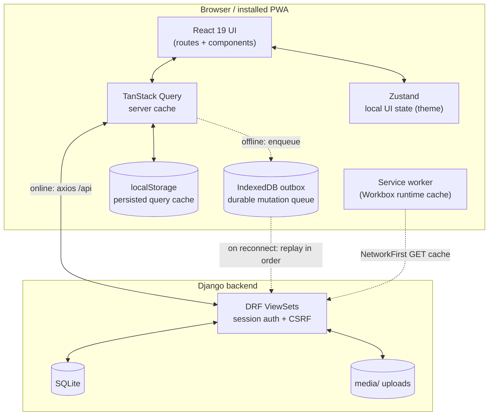
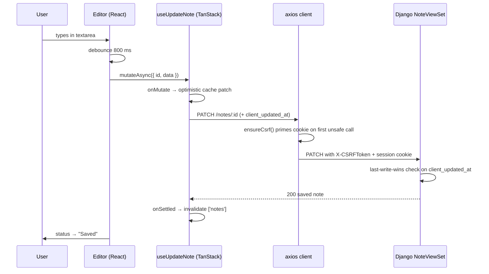
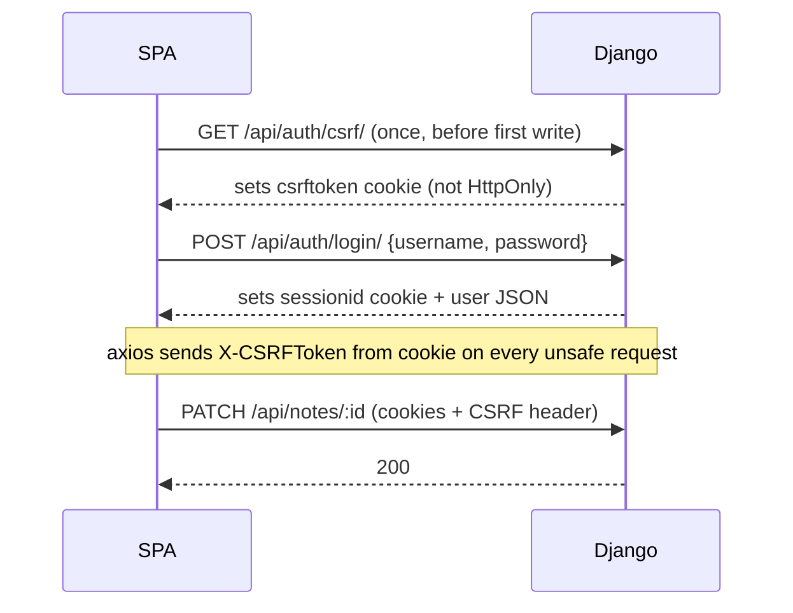

# Architecture

Turbo Notes is an **offline-first** markdown notes app. The interesting
engineering isn't "React talks to Django" — it's that the app stays fully usable
with no network, queues every change durably, and reconciles with the server on
reconnect without a save button. This page explains how the pieces fit and *why*
they're built the way they are.

## System overview



Two independent layers keep the app working offline:

1. **Reads** — TanStack Query's cache is persisted to `localStorage`, and the
   service worker caches `GET /api/*` responses (`NetworkFirst`). So lists and
   notes render from cache when the network is gone.
2. **Writes** — every mutation either hits the server (online) or is appended to
   a durable IndexedDB **outbox** (offline), then replayed in order on reconnect.

These are deliberately separate: read caching is best-effort and disposable;
the write queue is the source of truth for unsynced work and must survive
reloads, crashes, and days offline.

## Request lifecycle (online)



The **no save button** UX is a deliberate bet: a ~800 ms debounce
([`Editor.tsx`](../frontend/src/routes/Editor.tsx)) turns every keystroke into an
eventual autosave. The status line (`Saving…` / `Saved` / `Offline — will sync`
/ `Save failed`) is the only affordance the user needs.

## Key design decisions

### Last-write-wins, not CRDT/OT

Concurrent edits are resolved by a single client-supplied timestamp,
`client_updated_at`. The server rejects a write whose timestamp is older than
what it already stored ([`NoteViewSet.update`](../backend/notes/views.py)):

```python
if incoming_dt is not None and incoming_dt < stored:
    return Response(self.get_serializer(instance).data)  # keep stored version
```

**Why:** Turbo Notes is single-user-per-account and edits are debounced, so true
concurrent editing is rare (same user on two devices, one offline). LWW is a few
lines of code and has zero merge UI. The tradeoff we knowingly accept: a stale
write that loses the race is silently dropped — there's no field-level merge and
no conflict prompt. For a personal notes app that's the right amount of
machinery; CRDTs/OT would be a large amount of complexity for a problem this app
mostly doesn't have. See [offline-sync.md](./offline-sync.md) for the edge cases.

### TanStack Query *and* Zustand

They own different things, so both earn their place:

| Concern | Owner | Why |
| --- | --- | --- |
| Server data (notes, categories) | **TanStack Query** | caching, invalidation, offline persistence, optimistic updates — all built in |
| Local UI state (theme) | **Zustand** | tiny, synchronous, no server round-trip; persisted separately |

Putting theme in Query would be abuse (it's not server state); putting notes in
Zustand would mean re-implementing caching and invalidation by hand.

### UUID public shares

A note carries an unguessable `public_id` (UUID v4). Sharing flips `is_public`;
the public page reads `GET /api/public/notes/<uuid>/` through a separate view
with `authentication_classes = []` and `AllowAny`, serving a **read-only**
projection ([`PublicNoteSerializer`](../backend/notes/serializers.py)) that omits
internal fields. **Why a UUID and not a signed token:** the share is meant to be
durable and copy-pasteable, not expiring; revocation is just un-toggling
`is_public`. The default manager only returns `is_public=True, deleted_at=null`
notes, so trashing or un-sharing a note instantly 404s the public link.

### Soft delete

Deleting a note sets `deleted_at` instead of removing the row. A custom default
manager hides trashed notes; a second `all_objects` manager exposes them for the
Trash view and restore/purge actions ([`models.py`](../backend/notes/models.py)).
**Why:** Trash with restore is a core feature, and soft delete makes it trivial
while keeping attachments intact until a real `purge`.

### Offline-first network mode

TanStack Query is configured `networkMode: 'offlineFirst'` with a 7-day
`gcTime`, and the cache is dehydrated to `localStorage`
([`main.tsx`](../frontend/src/main.tsx)). Mutations check `isOffline()` and route
to the outbox instead of failing. **Why:** the app should behave identically
whether you're on wifi or on a plane — the only visible difference is the offline
banner and the `Offline — will sync` status.

## Auth & security model

Session-cookie auth (not tokens), because the SPA and API are same-origin in
both dev (via the Vite proxy) and a typical single-host deploy.



- **CSRF**: `CSRF_COOKIE_HTTPONLY = False` so the SPA can read the token; axios is
  configured with `xsrfCookieName/xsrfHeaderName` to echo it back. `ensureCsrf()`
  guarantees the cookie exists before the first mutation.
- **Same-origin**: the Vite dev server proxies `/api` and `/media` to Django
  (`vite.config.ts`) so cookies "just work" without CORS in dev. `CORS_ALLOWED_ORIGINS`
  / `CSRF_TRUSTED_ORIGINS` cover the case where the SPA is served from a
  different origin.
- **Authorization**: every queryset is scoped to `request.user`. A note can only
  reference one of *its owner's* categories (`validate_category`), and public
  reads are filtered to `is_public=True`.

See [development.md](./development.md) to run it and [deployment.md](./deployment.md)
for what changes in production.

## Where things live

| Area | Path |
| --- | --- |
| Offline outbox + sync | [`frontend/src/offline/`](../frontend/src/offline/) |
| API hooks (online/offline routing) | [`frontend/src/api/notes.ts`](../frontend/src/api/notes.ts) |
| Autosave editor | [`frontend/src/routes/Editor.tsx`](../frontend/src/routes/Editor.tsx) |
| Query client + persistence | [`frontend/src/main.tsx`](../frontend/src/main.tsx) |
| PWA / service worker config | [`frontend/vite.config.ts`](../frontend/vite.config.ts) |
| Models + LWW + soft delete | [`backend/notes/`](../backend/notes/) |
| Session/CSRF auth | [`backend/accounts/`](../backend/accounts/) |
