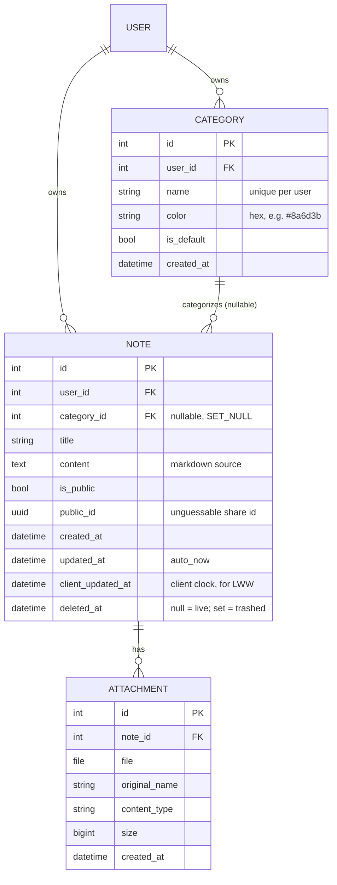

# Data model

Three tables, all owned by a user. SQLite in dev; the schema is plain Django ORM
so Postgres is a drop-in for production.

## Notes on each table

### Category
- **Unique `(user, name)`** constraint — no duplicate category names per user.
- Every new user is seeded with four `is_default=True` categories via a
  `post_save` signal ([`accounts/signals.py`](../backend/accounts/signals.py)):
  Grocery list, Money ideas, Random thoughts, Projects — each with a
  sepia-friendly preset color.
- Deleting a category **detaches** its notes (`category → NULL`) rather than
  cascading, so notes survive as "Uncategorized"
  ([`CategoryViewSet.destroy`](../backend/notes/views.py)).

### Note
- **Two managers** ([`models.py`](../backend/notes/models.py)):
  `objects` returns only live notes (`deleted_at IS NULL`); `all_objects`
  includes trashed ones. Restore/purge and the Trash view use `all_objects`.
- **`public_id`** is a UUID v4, indexed and unique — the basis for shareable
  `/n/<uuid>` links. It exists from creation but is only reachable while
  `is_public=True`.
- **`client_updated_at`** is supplied by the browser on each save and drives
  last-write-wins conflict resolution. Distinct from `updated_at`, which is the
  server's `auto_now` write time. See [offline-sync.md](./offline-sync.md).
- **`deleted_at`** implements soft delete — trash, restore, and permanent purge
  are just transitions of this one nullable timestamp.

### Attachment
- Files land at
  `media/attachments/<user_id>/<note_public_id>/<uuid>__<original-name>`
  (`attachment_upload_path`) — namespaced per user and note, collision-proof via
  a UUID prefix.
- Cascade-deleted with their note on purge. (Note: the DB row cascades; the
  on-disk file cleanup is a known gap — see
  [deployment.md](./deployment.md#known-gaps).)
- Images can be referenced from markdown to render inline in the preview.

## Serializer projections

The API never exposes the raw model. Two projections matter:

| Serializer | Used for | Notably includes / omits |
| --- | --- | --- |
| [`NoteSerializer`](../backend/notes/serializers.py) | the owner's CRUD | full fields incl. `client_updated_at`, nested `attachments` |
| `PublicNoteSerializer` | anonymous `/public/notes/<uuid>/` | **read-only subset**: title, content, author username, timestamps, attachments — no IDs, no `is_public`, no category |

This split is the enforcement point for "public means read-only and minimal":
anonymous viewers physically cannot receive fields the public serializer doesn't
list.
