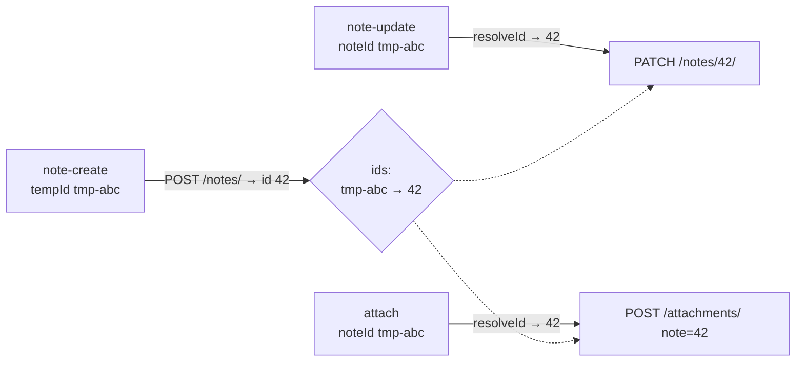
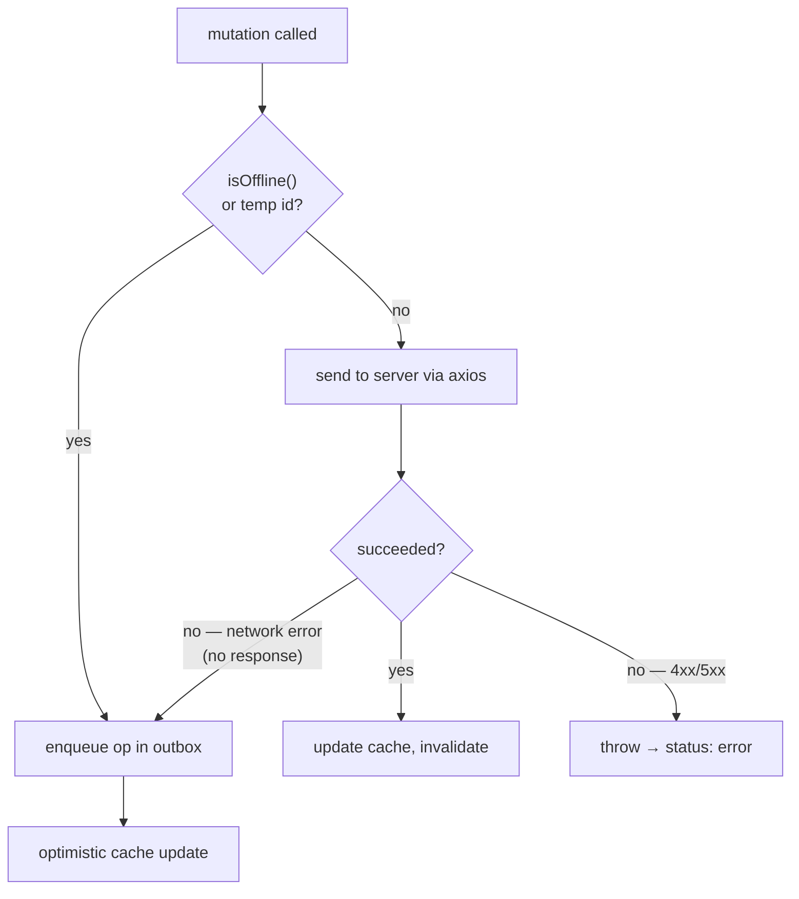
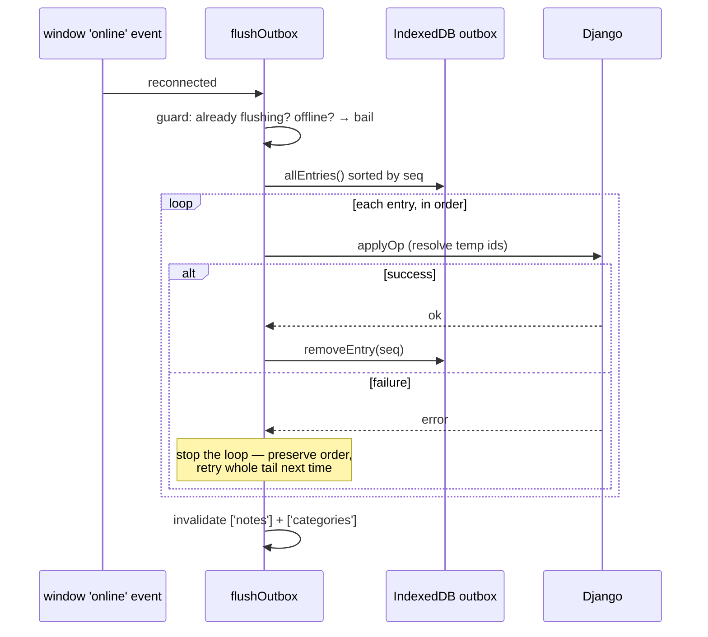

# Offline & sync

This is the feature Turbo Notes is built around: you can create and edit notes
with no network, and everything reconciles with the server when you reconnect —
no save button, no lost work, no manual conflict resolution. This page documents
how that works and, importantly, **where the edges are**.

## The two halves

| Direction | Mechanism | Survives reload? |
| --- | --- | --- |
| **Reading** offline | Persisted TanStack Query cache (`localStorage`) + service-worker `NetworkFirst` cache of `GET /api/*` | Yes |
| **Writing** offline | Durable IndexedDB **outbox** of ordered mutations | Yes |

Reads are best-effort and disposable. Writes are the part that must never lose
data, so they get their own durable, ordered queue.

## The outbox

[`frontend/src/offline/outbox.ts`](../frontend/src/offline/outbox.ts) is an
append-only, auto-incrementing IndexedDB store. Each entry is one mutation:

```ts
type OutboxOp =
  | { kind: 'note-create'; tempId: string; data: ... }
  | { kind: 'note-update'; noteId: number | string; data: ... }
  | { kind: 'note-delete'  | 'note-restore' | 'note-purge'; noteId: ... }
  | { kind: 'attach'; noteId: ...; file: Blob; name; contentType }
  | { kind: 'category-create' | 'category-update' | 'category-delete'; ... }
```

The `seq` key (auto-increment) preserves **order**, which is essential: a
`note-update` that follows a `note-create` must replay *after* it.

### Temp IDs: the create-then-edit problem

When you create a note offline there's no server ID yet. So the client mints a
**temporary ID** (`tmp-<uuid>`) and uses it everywhere — in the optimistic cache
entry and in any follow-up ops (edits, attachments) you make before reconnecting.

On flush, the create returns a real server ID, and that mapping is applied to
every later op that referenced the temp ID:



This remapping lives in [`sync.ts`](../frontend/src/offline/sync.ts) (`resolveId`
+ the `ids` map). If a create never succeeded, its temp ID stays unresolved and
dependent ops are **dropped** rather than sent with a bad ID.

## Write path: online vs. offline

Every mutation hook in [`api/notes.ts`](../frontend/src/api/notes.ts) makes the
same decision:



Note the third branch: a **network error mid-request** (axios sets no `response`)
is treated as "went offline" and falls back to the outbox, so a flaky connection
degrades gracefully instead of dropping the edit. A real `4xx/5xx` is a genuine
failure and surfaces as `Save failed`.

## Flush: replaying the queue

`flushOutbox()` runs on reconnect (the browser `online` event) and once at
startup, wired up by `installSync()` in
[`main.tsx`](../frontend/src/main.tsx):



Two properties make this safe:

- **Single-flight**: a module-level `flushing` flag prevents overlapping flushes
  (e.g. `online` event + startup firing together).
- **Stop-on-first-failure**: if op *N* fails, the loop breaks and leaves *N* and
  everything after it in the queue. Ordering is never violated, and the next
  reconnect retries from exactly where it stopped. Successfully-applied ops are
  removed one at a time, so a mid-flush crash just re-applies the tail.

## What the user sees

The [`OfflineBanner`](../frontend/src/components/OfflineBanner.tsx) polls
`pendingCount()` every 2 s and renders one of:

- **Offline** — `Offline — changes are saved locally (N queued) and will sync…`
- **Reconnecting with backlog** — `Syncing N pending changes…`
- **Online, empty queue** — hidden.

The editor's own status line shows per-save state (`Saving…` / `Offline — will
sync`), derived from `navigator.onLine` at save time.

## Known edge cases & limits

Being honest about the failure modes is the point — here's what this design does
*not* do, by choice:

1. **Last-write-wins drops stale edits silently.** If you edit a note offline on
   device A while device B (online) edits the same note later, B's newer
   `client_updated_at` wins, and A's queued write is accepted by the server but
   overwritten — no merge, no prompt. See the LWW check in
   [`NoteViewSet.update`](../backend/notes/views.py).

2. **A non-retryable 4xx blocks the queue.** Stop-on-first-failure preserves
   order, but a permanently-failing op (e.g. validation error) will halt the
   flush every time until it's cleared. Acceptable for v1; a dead-letter lane
   would be the v2 fix. The halted op is logged via `console.warn` (visible in
   `dev.py` output as a `WARN` line).

3. **Outbox entries aren't deduped or coalesced.** Ten edits to the same note
   offline produce ten `note-update` ops. They all replay (last one wins on the
   server anyway), so it's correct but chatty.

4. **Clock skew affects LWW.** `client_updated_at` is the *client's* clock. A
   badly-wrong device clock could make a stale edit win or a fresh edit lose.

5. **Attachments queue the full `Blob` in IndexedDB.** Large offline uploads
   consume IndexedDB quota until synced.

## Testing it by hand

1. `python3 dev.py` and log in.
2. Open DevTools → Network → set **Offline** (or toggle wifi).
3. Create a note, edit it, add an image — watch the banner show queued changes.
4. Reload the page: your offline note and edits are still there (persisted cache
   + outbox).
5. Go back **Online** — watch `dev.py` print the replayed `POST/PATCH` requests
   as `INFO` lines and the banner clear.
